+++
title = "Solaris Community Poll 2024 Results"
date = 2024-05-25
+++

Hey everyone!

we had a community poll in the last weeks to gather some statistics, ideas for improvements and to further guide the development process of Solaris.

First, I'd like to thank everyone who participated! We got 81 response which is a good number!

In this post, I'd like to share some of the statistical results and first conclusions.

## Statistical results

### How long have you been playing Solaris?

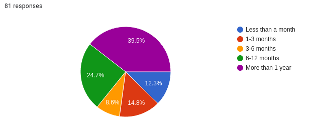

### Do you frequent the Solaris discord?

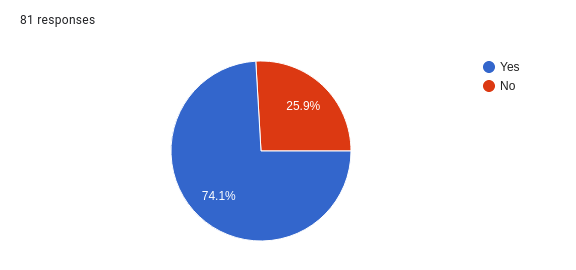

Interesting to see that 25% of players are not on the discord!

Since the discord is marketed relatively heavily, it also means that I think something should be done to improve communication with the non-discord playerbase.

### How did you discover Solaris?

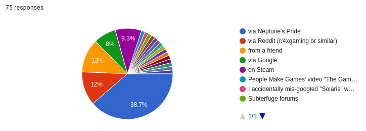

*Only popular responses shown*

Surprisingly few people came from Steam. There are definitely some things that could be done to market Solaris more beyond those coming over from similar games.

### How frequently do you play Solaris on the following devices:

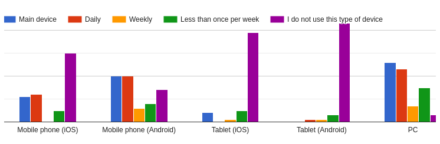

Overall, there are 3 players playing mobile-only and 2 players never checking Solaris on their mobile phone.

### Do you use the Solaris Steam client?

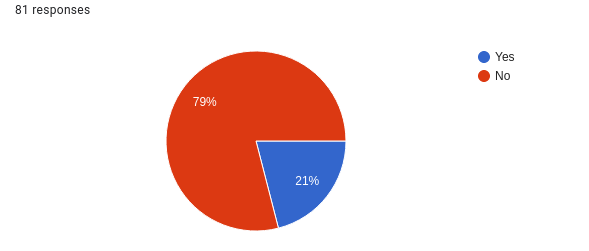

To be honest, there is not much of a point to using the Steam client since the experience is identical to the website, except if you want to know how much time you spend desparately staring at the galaxy map.

### Do you use the Solaris mobile app for Android?

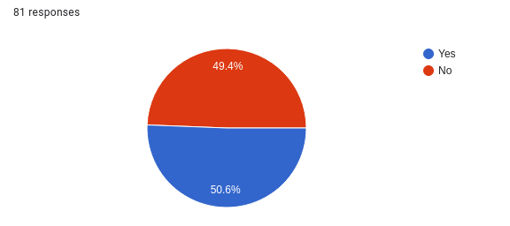

### Would you be interested in a Solaris app for iOS?

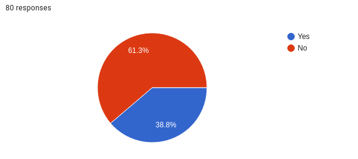

That's quite a number, would be nice to have (and is certainly possible to make). Would be nice to have a better UI though before expanding on the mobile offerings (and native notifications would be nice too).

### What is your opinion on the following statements:

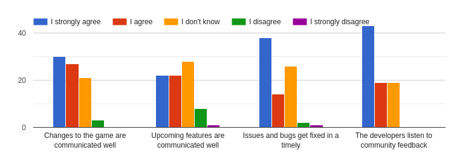

### How could we improve?

*Addressing that later*

### How do you feel about the following aspects of Solaris:

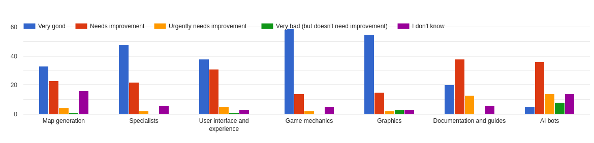

### What do you think is the hardest or most annoying part of playing Solaris?

*Addressing that later*

### How could it be improved?

*Addressing that later*

### How much do you like the following aspects of the gameplay?

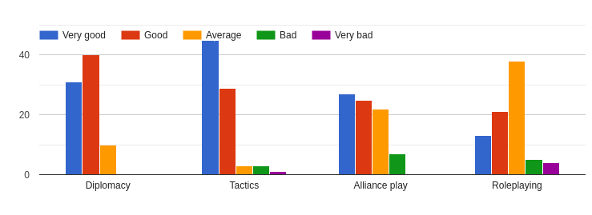

### Is there a feature you'd like to see added to improve your preferred aspect?

*Addressing that later*

### How much do you agree or disagree with the following statements?

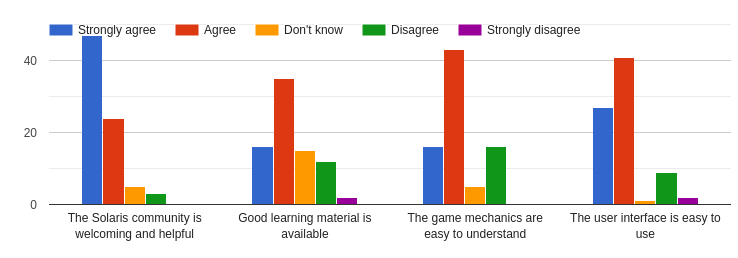

### What game mode do you enjoy the most?

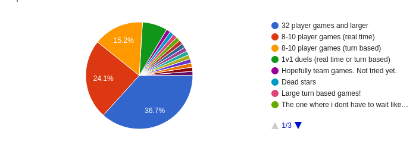

I abridged the responses, but besides specific special game modes, there were asks for larger turn-based games.

### Would you like to see an official game mode added?

*Addressing that later since it's a bunch of suggestions, I've noted them*

### Would you be interested in more frequent 48 or 64 player games?

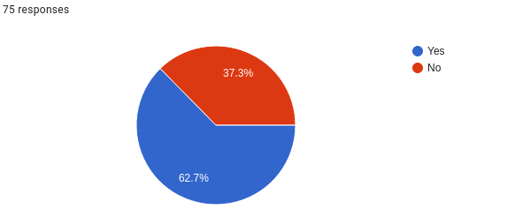

That's quite a number of people. I think we should have one again this year, but I feel like there are some things that need improvement. More on that later.

### What is one feature that you'd love to see added to Solaris?

*Addressing that later*

### What community events would you like to see in the next year?

Frequent answers were:
- Large games
- Team games
- Guild games
- Tournaments and competitions
- Custom maps

Honorary mention for "intergalactic bagpipes". That will need some looking into until it can be arranged.

### Anything else you'd like to say?

A number of suggestions for both the game and community that have been taken notice of.
Also, a lot of really nice messages, thanks!

## Conclusions

Based on the feedback from the poll, it seems neccessary to improve communications about upcoming features, accepted suggestions etc. since there were several remarks regarding this. 

My plan for improving this situation is by making a follow-up post with a rough roadmap that should, based partially on the feedback and suggestions received from the poll, guide what I plan to develop the rest of the year, mostly focusing on some major goals for each quarter.

All of us Solaris developers work on Solaris voluntarily in their freetime, due to the nature of that, the development process is unsteady and cannot be planned accurately. Subscribing to a strict schedule is impossible, therefore a roadmap should only be taken as a rough guideline concerning major features, improvements and changes. Generally, I am aiming, as I have for the last months, for making at least one release per month, bringing in bugfixes, features and contributions from other developers as far as possible. There is actually still a backlog of pull requests that I haven't finished reviewing, those will come soon as well.

Regarding suggestions, since the question was raised recently and also in the poll, any decent suggestion has been getting noted down by me and together with technical improvements and my own ideas is stored in a task managment system, from where releases are roughly drafted. I'll consider in how far this could be made more public or open for transparency reasons and to allow insight into past suggestions, however, there are some concerns around security, privacy and technical details.

Additionally, one major point of dissatisfaction is with the state of learning guides and documentation. Improvements in some areas are already underway and I hope for further and continued community participation in that area.

Another surprising fact is that there is a significant number of players that do not frequent the Discord. I'm planning to make changes to the website (like publishing announcements there) to better commmunicate changes and make it immediately obvious that development is ongoing.

## Afterword

I'd like to thank:

The Solaris community for the trust and support in the three months since I took over project leadership.

All contributors and developers for supporting Solaris and making it continously greater.

And of course Hyperi0n, for making an amazing game with a great community.

-- LimitingFactor